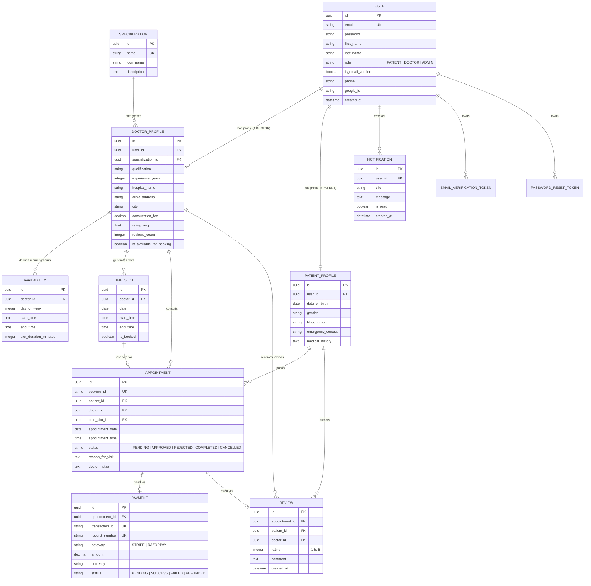

# MediConnect Healthcare Platform - Entity Relationship (ER) Diagram

The following Mermaid ER Diagram illustrates the database structure, normalized models, and foreign key relationships across all modules of MediConnect.

